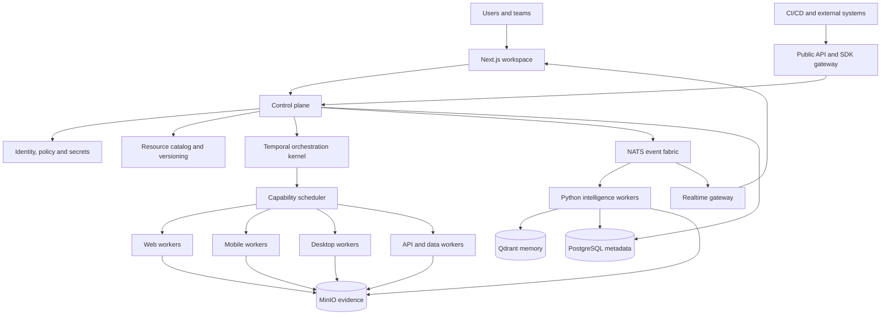
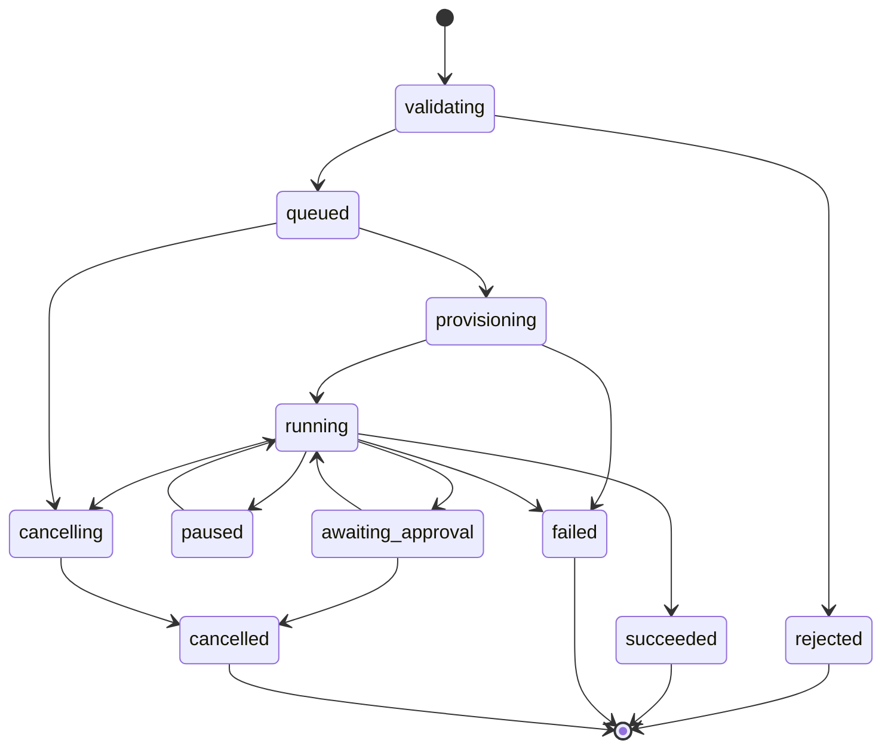

# NexCore OS Architecture

## 1. Architecture decision

NexCore OS is a domain-specific operating system for execution intelligence. The operating-system metaphor maps to real platform responsibilities:

| OS concept | NexCore OS responsibility |
|---|---|
| Kernel | Execution contracts, lifecycle rules, scheduler, policy enforcement |
| Process | A workflow run, node attempt, AI job, or maintenance job |
| Driver | Playwright, Appium, desktop, API, database, or future adapter |
| Filesystem | Versioned projects, workflows, datasets, artifacts, and evidence |
| Package manager | Signed plugins, templates, connectors, and capability manifests |
| Identity and permissions | Tenants, workspaces, roles, service identities, secrets, policies |
| Shell | Web workspace, CLI, public API, and SDK |
| System monitor | Live execution graph, logs, metrics, traces, cost, and audit history |

The kernel must never depend directly on Playwright, Appium, desktop-driver, LLM-provider, or UI-specific concepts.

## 2. System context



## 3. Planes and ownership

### Experience plane

Technology: Next.js, React, TypeScript, React Flow.

Owns workspace navigation, workflow authoring, live monitoring, evidence review, approval experiences, administration, and accessibility. It does not decide execution state or contain automation-driver logic.

### Control plane

Initial technology: NestJS and TypeScript. ASP.NET Core remains a future option after contracts become stable and a measured proof of concept demonstrates value.

Owns public APIs, resource catalog, tenancy, authorization, workflow versions, environment definitions, schedules, execution commands, audit, quotas, plugin metadata, and realtime subscriptions. It does not run browser or device automation.

### Orchestration kernel

Technology: Temporal.

Owns durable execution, dependency traversal, retry, timeout, cancellation, compensation, pause/resume, approval waits, replay, and terminal-state calculation. Workflow code must be deterministic. External I/O belongs in activities.

### Execution plane

Primary technology: Python workers and isolated runtime agents.

Owns concrete automation sessions, runtime-specific commands, artifact capture, structured outputs, health reporting, and cancellation compliance. Workers are replaceable and discovered by capabilities rather than hard-coded hostnames.

### Intelligence plane

Technology: Python, provider-neutral model gateway, Qdrant.

Owns evidence correlation, failure classification, retrieval, repair proposals, risk scoring, and optimization suggestions. AI may propose actions but cannot mutate canonical workflows or lifecycle state without policy evaluation and, where required, human approval.

### Data plane

- PostgreSQL: canonical metadata and transactional state.
- MinIO: screenshots, videos, traces, attachments, reports, and large logs.
- Qdrant: embeddings and retrieval indexes; never the source of truth.
- NATS JetStream: integration events and fan-out; never the sole record of canonical state.

## 4. Kernel resource model

All resources have `id`, `tenant_id`, `workspace_id`, `version`, `created_at`, `created_by`, labels, and an immutable audit trail where applicable.

```text
Tenant
└── Workspace
    ├── Project
    │   ├── Intent
    │   ├── Workflow
    │   │   └── WorkflowVersion (immutable)
    │   ├── Dataset
    │   └── Environment
    ├── PluginInstallation
    ├── RuntimePool
    │   └── RuntimeAgent
    ├── SecretReference
    └── Policy

Execution
├── ExecutionNode
│   └── NodeAttempt
├── Event
├── Artifact
├── VariableSnapshot
├── Approval
└── Diagnosis
```

Workflow versions and execution inputs are immutable after a run starts. Corrections create a new version or an explicit append-only event.

## 5. Stable contracts

### Execution request

```json
{
  "contractVersion": "1.0",
  "executionId": "exe_...",
  "workflowVersionId": "wfv_...",
  "environmentId": "env_...",
  "input": {},
  "requestedCapabilities": ["web.playwright.chromium"],
  "policyContext": { "tenantId": "ten_...", "actorId": "usr_..." }
}
```

### Node execution envelope

```json
{
  "contractVersion": "1.0",
  "executionId": "exe_...",
  "nodeId": "node_...",
  "attempt": 1,
  "operation": "web.click",
  "configuration": {},
  "timeoutSeconds": 30,
  "requiredCapabilities": ["web.playwright"],
  "contextReferences": [],
  "secretReferences": []
}
```

Secrets are references, not values. Workers resolve them just in time through authorized, audited access and must not include them in logs or artifacts.

### Event envelope

Every event includes:

- `eventId`, `eventType`, `eventVersion`, and `occurredAt`.
- `tenantId`, `workspaceId`, `correlationId`, and `causationId`.
- Resource identity and execution/node/attempt identity when relevant.
- Producer identity and trace context.
- A schema-versioned payload.

Consumers must be idempotent. Events describe facts; commands request actions.

### Capability manifest

A runtime agent advertises versioned capabilities such as:

```json
{
  "agentId": "agent_...",
  "platform": "windows",
  "capabilities": {
    "web.playwright.chromium": "1.45",
    "desktop.windows.uia": "1.0"
  },
  "capacity": 4,
  "labels": { "region": "in-south", "networkZone": "internal" }
}
```

The scheduler matches capability, version, tenant policy, environment reachability, capacity, locality, health, and cost.

## 6. Execution lifecycle



Only the orchestration kernel owns transitions. APIs submit commands; workers report outcomes; AI supplies recommendations.

## 7. Critical runtime flows

### Start and execute

1. API authenticates the actor and authorizes `execution.start`.
2. Control plane validates immutable workflow version, environment, quota, and policy.
3. It creates the execution and starts a Temporal workflow using the execution ID as the idempotency key.
4. Kernel resolves ready nodes and requests capability placement.
5. Scheduler leases an eligible runtime agent with a bounded, renewable lease.
6. Worker executes the envelope and uploads evidence directly to MinIO using short-lived credentials.
7. Worker returns structured outcome and artifact metadata.
8. Kernel persists the transition and emits an integration event.
9. Realtime gateway projects events to authorized subscribers.

### Diagnose and repair

1. A failure event starts an asynchronous diagnosis workflow.
2. Intelligence worker retrieves only evidence authorized for that tenant and execution.
3. It returns a structured diagnosis containing evidence citations, confidence, and proposed changes.
4. Policy classifies the proposal as auto-applicable, approval-required, or prohibited.
5. An approved repair creates a new workflow version; history is never overwritten.
6. Kernel reruns the failed node or affected subgraph using explicit replay semantics.

## 8. Security and tenancy boundaries

- Tenant identity is derived from authenticated claims, never trusted from request bodies.
- Authorization is evaluated at API entry and again for sensitive resource access.
- PostgreSQL uses tenant-scoped queries and preferably row-level security as defense in depth.
- Every object key begins with tenant/workspace identity and is served through short-lived signed access.
- Secrets remain in a secret manager; database records contain references and metadata only.
- Runtime agents use workload identities, mutual TLS, short leases, and revocable credentials.
- Plugins execute with declared permissions, constrained network access, resource limits, and signed manifests.
- AI prompts and retrieval are tenant-isolated, redacted, and auditable.
- Administrative changes, approvals, secret access, exports, and plugin installation are audited.

## 9. Plugin and package model

A package contains a signed manifest, configuration JSON Schema, input/output schemas, capability requirements, permissions, compatibility range, health checks, and migration hooks.

Plugin types:

- Execution driver: concrete runtime operations.
- Intent compiler: maps business actions to executable operations.
- Integration connector: Jira, GitHub, CI/CD, messaging, or observability.
- Intelligence provider: diagnosis or generation capability.
- UI extension: declarative panels only at first; arbitrary frontend code requires a stronger sandbox.

The registry may install and activate plugins, but only the kernel controls lifecycle transitions.

## 10. API and realtime strategy

- REST/OpenAPI is the public command and resource API.
- Server-sent events or the existing WebSocket gateway can stream execution projections initially.
- NATS is internal infrastructure and is not exposed directly to browsers.
- Generate TypeScript and Python clients from versioned schemas rather than sharing internal models.
- Use additive API evolution, explicit deprecation windows, and contract tests.
- SignalR is useful only if the control plane later moves to ASP.NET Core; it is not itself a reason to rewrite.

## 11. Reliability rules

- Use idempotency keys on execution start, retry, approval, and external callbacks.
- Use an outbox pattern for database state plus event publication.
- Treat delivery as at least once and make every consumer idempotent.
- Separate user failure, automation failure, infrastructure failure, policy rejection, and plugin defect.
- Bound retries with exponential backoff and jitter; do not retry deterministic validation failures.
- Use leases and heartbeats for runtime placement and orphan recovery.
- Put timeouts and cancellation propagation on every remote operation.
- Store checksums and retention policy with every artifact.
- Define recovery objectives and regularly test PostgreSQL, MinIO, and configuration restoration.

## 12. Observability model

Every request and execution shares a correlation ID and OpenTelemetry trace context. Minimum signals:

- API latency, error rate, and authorization denials.
- Queue depth, scheduling latency, and agent utilization.
- Node duration, retry rate, cancellation latency, and failure classification.
- Artifact upload failures and storage growth.
- Temporal workflow/activity failures and replay errors.
- NATS consumer lag and dead-letter volume.
- AI latency, token/cost usage, confidence, acceptance rate, and unsafe-output rejection.

Logs are structured and redacted. Metrics must not contain tenant IDs or other unbounded labels.

## 13. Deployment topology

```text
Edge/API zone
  Next.js web, API gateway, realtime gateway

Control zone
  NestJS control plane, Temporal workers, scheduler, policy service

Execution zones
  Ephemeral web/API workers
  Dedicated mobile device workers
  Windows desktop agents near target applications

Data zone
  PostgreSQL, MinIO, Qdrant, NATS, Temporal persistence, secret manager
```

Control services should be stateless and horizontally scalable. Desktop and mobile agents may be long-lived but receive short-lived execution leases. Execution zones can exist in NexCore-managed infrastructure or inside a customer's network.

## 14. Repository target

```text
NexCore/
├── Nexus-Advanced/          # Experience plane
├── nexus-backend/           # Control plane and Temporal kernel
├── nexus-api/               # Python execution/intelligence plane
├── contracts/               # OpenAPI, JSON Schema, event schemas
├── sdk/                     # Generated clients and plugin SDKs
├── agents/                  # Deployable runtime-agent packaging
├── infra/                   # Local, Kubernetes, security, observability
└── Nexcore OS/              # Product architecture and decisions
```

Do not reorganize working code merely to match this tree. Introduce boundaries as features are implemented.

## 15. Delivery roadmap

### Foundation: kernel contracts

- Freeze canonical identifiers, resource schemas, execution/node states, and event envelope.
- Add schema versioning, idempotency, correlation, outbox publication, and contract tests.
- Establish tenant, workspace, secret, artifact, and audit boundaries.

Exit criterion: one execution can be reconstructed completely from canonical state and its append-only timeline.

### Vertical slice: excellent web loop

- Author and version a workflow.
- Schedule a Playwright-capable agent.
- Stream live status and collect complete evidence.
- Diagnose failure and approve a versioned repair.
- Rerun the affected subgraph.

Exit criterion: the complete define-to-repair loop works reliably without manual database intervention.

### Platform drivers

- Formalize the capability registry and remote-agent leases.
- Add API/data, mobile, and desktop drivers one at a time.
- Publish compatibility and conformance tests for every driver.

Exit criterion: new drivers can be installed without changing kernel code.

### Ecosystem

- Publish plugin SDK, signing, permission review, package lifecycle, and marketplace governance.
- Add CLI, CI integrations, reusable templates, import/export, and customer-hosted agent pools.

Exit criterion: an external team can build, test, install, observe, and safely remove a plugin.

### Autonomous optimization

- Add policy-bounded repair, risk scoring, experiment evaluation, and cost optimization.
- Require evidence citations and rollback for every automated mutation.

Exit criterion: automation improves measured outcomes without weakening governance or reproducibility.

## 16. Decisions to avoid

- Do not build a literal operating system or custom kernel.
- Do not rewrite NestJS in .NET before measuring a concrete limitation.
- Do not merge control, orchestration, execution, and AI ownership into one service.
- Do not let workers or AI update execution state directly.
- Do not make NATS, Qdrant, or realtime projections sources of truth.
- Do not create many independently deployed microservices before team size and scaling needs justify them.
- Do not start with a marketplace; first prove a stable kernel and one excellent vertical workflow.

## 17. Near-term implementation decisions

1. Preserve the current Next.js, NestJS, Temporal, NATS, and Python foundation.
2. Treat NestJS as a modular control plane rather than splitting it prematurely.
3. Move browser/device execution behind versioned envelopes and capability leases.
4. Introduce `contracts/` as the language-neutral boundary.
5. Make PostgreSQL canonical, MinIO evidentiary, Qdrant derived, and NATS distributive.
6. Complete the web define-execute-observe-diagnose-repair loop before expanding breadth.

This approach turns the current product into an operating-system-style platform through stable ownership and extensibility, without paying the risk of an unrelated technology rewrite.
