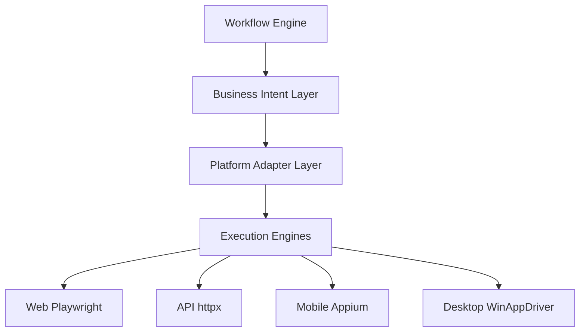
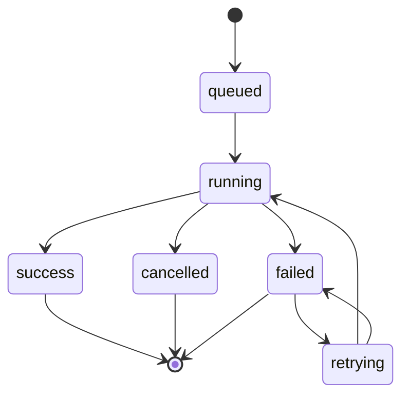

# NEXUS QA Master Execution Checklist

## 1. Current Baseline Mapping Against 10-Phase Target

This repository already contains a partial implementation spanning parts of later phases. This checklist enforces strict controlled sequencing from this point forward.

### Baseline Summary

- Backend orchestration core exists: DAG traversal, node lifecycle, retry, cancellation, event bus, websocket broadcast.
- Plugin abstraction exists with API and Web execution plugins.
- Frontend workspace shell and multiple dashboards exist.
- Workflow and execution persistence models already exist.
- Current implementation is split across:
  - `nexus-qa`: Next.js product UI.
  - `nexus-api`: Python FastAPI prototype for orchestration, execution, runtime adapters, and enterprise scaffolding.
  - `nexus-backend`: early NestJS foundation for the target TypeScript control plane.
- Target ownership remains: TypeScript/NestJS owns product orchestration, realtime, execution control, contracts, auth, tenancy, and scheduling. Python owns AI, OCR, CV, ML, Pytest, and intelligent analysis workers.

### Phase Readiness Snapshot

| Phase | Status in repo | Control Decision |
|---|---|---|
| 1 Product Foundation | Documentation and contracts complete | Keep as source of truth |
| 2 Frontend Design System | Foundation implemented in Next.js | Continue hardening during touched UI work |
| 3 Workflow Builder UX | Prototype/foundation implemented | Production node config UX still needs hardening |
| 4 Orchestration Engine | Python prototype plus NestJS control-plane scaffold implemented | Temporal workflow ownership pending |
| 5 Web and API Plugins | Python plugin foundation implemented | Verify and harden real Playwright/httpx execution |
| 6 Execution Intelligence | Heuristic prototype plus AI gateway/worker boundary implemented | LangGraph and vector memory pending |
| 7 Intent Layer | Basic registry/compiler implemented | Contract hardening and NestJS migration pending |
| 8 Mobile and Desktop | Adapter/plugin foundation implemented | Real Appium/WinAppDriver device verification pending |
| 9 Distributed Execution | NestJS scheduler plus external agent scaffold implemented | Real fleet dispatch/load verification pending |
| 10 Enterprise Platform | Enterprise scaffolding and Kubernetes manifests implemented | Production SSO, secrets, policy, and deployment hardening pending |

### Implementation Truth Table

| Status Label | Meaning |
|---|---|
| Complete | Fully implemented and verified for the current target scope. |
| Foundation Implemented | Code/contracts exist and can guide product work, but production verification or migration remains. |
| Prototype Implemented | Works as a local/prototype implementation, but not the final architecture owner. |
| Pending | Not implemented beyond documentation or placeholders. |

### Current Completion Summary

| Phase | Honest Completion State |
|---|---|
| Phase 1 | Complete as documentation/contracts. |
| Phase 2 | Foundation implemented. |
| Phase 3 | Prototype/foundation implemented. |
| Phase 4 | Python prototype and NestJS orchestration API scaffold implemented; Temporal migration pending. |
| Phase 5 | Python plugin foundation and NestJS execution contracts implemented; local Playwright/API verification complete, GitHub Actions rerun pending. |
| Phase 6 | Heuristic prototype, NestJS AI gateway, and Python worker boundary implemented; LangGraph/Qdrant pending. |
| Phase 7 | NestJS now owns intent contracts/compiler, schema compatibility, and production validation fixtures; real runtime/device verification remains pending in later phases. |
| Phase 8 | Adapter foundation implemented; real device/application verification pending. |
| Phase 9 | Distributed control-plane and external agent scaffold implemented; real fleet dispatch/load verification pending. |
| Phase 10 | Enterprise scaffolding and Kubernetes manifests implemented; production SSO/secrets/tenant/deployment hardening pending. |

---

## 2. Architecture Control Principle

Mandatory layer order:

1. Workflow Engine
2. Business Intent Layer
3. Platform Adapter Layer
4. Execution Engines

Rule: Workflow Engine is execution-framework agnostic. No Playwright, Appium, or WinAppDriver assumptions inside orchestration core.

---

## 3. Phase-by-Phase Controlled Execution Checklist

## Phase 1 Product Foundation

### Entry Criteria

- Product scope confirmed as orchestration intelligence plus business intent abstraction.
- Existing codebase audited and mapped to architecture boundaries.
- No net-new feature implementation started.

### Execution Checklist

- [x] Finalize product vision and problem boundaries.
- [x] Define canonical entity model.
- [x] Define execution lifecycle and state machine contract.
- [x] Define workflow schema and node schema.
- [x] Define event contracts and event versioning policy.
- [x] Define plugin architecture contracts and isolation rules.
- [x] Define execution states and transition constraints.
- [x] Produce architecture documentation and system maps.
- [x] Produce database schema specification.
- [x] Produce event lifecycle definitions.

### Deliverables

- Architecture specification document.
- Mermaid architecture and lifecycle diagrams.
- Canonical entity and schema definitions.
- Event contract catalog.
- Plugin contract specification.

Phase 1 deliverable files:

- `plans/phase-1/architecture-specification.md`
- `plans/phase-1/canonical-entity-and-schema-definitions.md`
- `plans/phase-1/execution-lifecycle-and-state-machine-contract.md`
- `plans/phase-1/event-contract-catalog.md`
- `plans/phase-1/plugin-contract-specification.md`
- `plans/phase-1/database-schema-specification.md`
- `plans/phase-1/system-maps.md`

### Strict Out of Scope

- No new runtime features.
- No UI redesign implementation.
- No new automation engine integrations.
- No AI autonomy work.

### Exit Criteria

- All contracts are documented and internally consistent.
- Layer boundaries are explicit and testable.
- Phase 2 backlog is derived from approved foundation contracts.

---

## Phase 2 Frontend Design System

### Entry Criteria

- Phase 1 contracts approved.
- UX information architecture approved.

Status note: Proceeding under the current user instruction to continue phase-by-phase. Phase 1 contracts are now documented in `plans/phase-1/`, and Phase 2 normalization is documented in `plans/phase-2/`.

### Execution Checklist

- [x] Define design tokens.
- [x] Define shell layout and workspace architecture.
- [x] Build reusable component primitives.
- [x] Define motion system and interaction semantics.
- [x] Define theme engine.
- [x] Define responsive behavior model.

### Deliverables

- Reusable UI primitives.
- Application shell.
- Motion and theme standards.

Phase 2 deliverable files:

- `plans/phase-2/frontend-design-system-contract.md`
- `plans/phase-2/frontend-boundary-audit.md`

### Strict Out of Scope

- No business orchestration logic.
- No real execution control logic.

### Exit Criteria

- UI foundation supports workflow IDE and execution observability surfaces without feature coupling.

---

## Phase 3 Workflow Builder UX

### Entry Criteria

- Phase 2 UI primitives and shell complete.

### Execution Checklist

- [x] Integrate React Flow for DAG editing.
- [x] Implement node and edge systems.
- [x] Implement node inspector panels.
- [x] Implement save and load workflow persistence UX.
- [x] Implement execution simulation traversal visuals.
- [x] Implement realtime node animation states.

### Deliverables

- Workflow IDE.
- Node configuration UX.
- Save and load workflow operations.

Phase 3 deliverable files:

- `plans/phase-3/workflow-builder-ux-implementation.md`

### Strict Out of Scope

- No real browser or API automation execution.

### Exit Criteria

- Users can visually author and simulate complete workflows with deterministic traversal feedback.

---

## Phase 4 Orchestration Engine

### Entry Criteria

- Workflow schema stable from phase 1.
- Workflow builder data contracts stable from phase 3.

### Execution Checklist

- [x] Finalize DAG traversal engine behavior.
- [x] Finalize dependency resolver and wave scheduling.
- [x] Finalize lifecycle, retry, cancellation, and skip semantics.
- [x] Finalize event bus contracts and websocket stream behavior.
- [x] Finalize timeline and variable propagation models.
- [x] Implement execution replay model with simulated nodes.
- [x] Add NestJS orchestration control-plane module and execution contract boundary.
- [ ] Migrate durable orchestration ownership from Python prototype to Temporal workflows.
- [ ] Replace in-process background execution with Temporal workflow execution.

### Deliverables

- Live execution simulation engine.
- Realtime orchestration stream.
- Deterministic node lifecycle engine.

Phase 4 deliverable files:

- `plans/phase-4/orchestration-engine-hardening.md`

### Strict Out of Scope

- No real Playwright or real API calls in production path.

### Exit Criteria

- Python prototype execution is deterministic, observable, and replayable.
- Production exit remains pending until NestJS/Temporal owns orchestration.

---

## Phase 5 Web and API Execution Plugins

### Entry Criteria

- Phase 4 orchestration contracts stable and plugin-ready.

### Execution Checklist

- [x] Implement Playwright plugin lifecycle and node handlers.
- [x] Implement API execution engine with httpx.
- [x] Implement runtime variable interpolation and propagation.
- [x] Implement artifact capture and indexing.
- [x] Implement streaming logs and node-level evidence events.
- [x] Finalize first real MVP node set.
- [x] Verify Playwright execution against stable target applications locally and remove missing-baseline screenshot failures.
- [x] Verify API plugin behavior with contract tests and failure fixtures locally.
- [ ] Re-run GitHub Actions Playwright matrix and confirm Chromium/Firefox/WebKit jobs pass.
- [x] Move execution-control contracts to NestJS while keeping runtime execution isolated.

### Deliverables

- Real workflow execution for web and API.
- Realtime browser and API monitoring.
- Artifact pipeline for screenshot, trace, request, response.

Phase 5 deliverable files:

- `plans/phase-5/web-and-api-plugin-implementation.md`

### Strict Out of Scope

- No mobile or desktop execution.
- No intent abstraction logic.

### Exit Criteria

- Plugin foundation exists for end-to-end web/API execution.
- Production exit remains pending until the GitHub Actions rerun passes and TypeScript control-plane migration is complete.

---

## Phase 6 Execution Intelligence

### Entry Criteria

- Stable real execution data sources from phase 5.

### Execution Checklist

- [x] Build log and artifact correlation foundation.
- [x] Implement root cause heuristic prototype.
- [x] Implement flaky pattern detection prototype.
- [x] Implement retry recommendation prototype.
- [x] Implement anomaly detection prototype over execution graph.
- [x] Implement selector failure analysis prototype.
- [x] Implement Python AI investigation worker boundary.
- [ ] Implement Python LangGraph workflow for evidence-grounded RCA.
- [ ] Implement Qdrant-backed execution/failure memory.
- [x] Add NestJS AI gateway for job dispatch and result validation.
- [ ] Add realtime AI result streaming over Socket.IO/NATS.

### Deliverables

- AI investigation workspace.
- Execution intelligence engine.

Phase 6 deliverable files:

- `plans/phase-6/execution-intelligence-implementation.md`

### Strict Out of Scope

- No autonomous agent planning or autonomous remediation.

### Exit Criteria

- Prototype intelligence outputs are explainable and linked to raw evidence.
- Production exit remains pending until Python AI workers and NestJS AI gateway are implemented.

---

## Phase 7 Business Intent Layer

### Entry Criteria

- Phase 5 and 6 stable enough to separate intent from engine specifics.

### Execution Checklist

- [x] Implement business intent engine.
- [x] Implement intent registry.
- [x] Implement capability matrix by platform.
- [x] Implement platform mapping contracts.
- [x] Implement adapter contract validation.
- [x] Migrate intent contracts and compiler authority to NestJS.
- [x] Add versioned intent schemas with compatibility tests.
- [x] Add production validation fixtures for cross-platform mappings.

### Deliverables

- Intent-driven workflow specification.
- Platform abstraction engine.

Phase 7 deliverable files:

- `plans/phase-7/business-intent-layer-implementation.md`

### Strict Out of Scope

- No direct mobile or desktop runtime integration until contracts are validated.

### Exit Criteria

- Basic intent can compile into platform-specific executable plans through adapters.
- Production exit remains pending until later-phase runtime/device verification is complete.

---

## Phase 8 Mobile and Desktop Execution

### Entry Criteria

- Phase 7 intent and adapter contracts approved.

### Execution Checklist

- [x] Integrate Appium runtime and adapters.
- [x] Implement Android and iOS execution support.
- [x] Integrate WinAppDriver desktop adapter.
- [x] Implement environment isolation patterns.
- [x] Validate cross-platform parity at compiler/adapter-contract level.
- [ ] Validate Appium Android execution against a real emulator/device.
- [ ] Validate Appium iOS execution against a real simulator/device.
- [ ] Validate WinAppDriver execution against a real Windows application.
- [ ] Run cross-platform parity tests against target business flows.

### Deliverables

- Same business flow on web, mobile, and desktop.

Phase 8 progress files:

- `plans/phase-8/mobile-and-desktop-execution-readiness.md`

### Strict Out of Scope

- No distributed cloud scheduling orchestration yet.

### Exit Criteria

- Adapter-level intent parity exists across supported platforms.
- Production exit remains pending until real mobile and desktop runtimes are installed, configured, and tested.

---

## Phase 9 Distributed Execution System

### Entry Criteria

- Multi-platform local execution stable from phase 8.

### Execution Checklist

- [x] Build distributed agent model.
- [x] Build queue orchestration.
- [x] Build agent health monitoring.
- [x] Build worker scheduling and shard strategy.
- [x] Document cloud execution topology.
- [x] Implement external long-running runtime agent scaffold.
- [x] Implement agent command polling scaffold.
- [x] Move scheduling authority to NestJS target control plane.
- [ ] Add load test for horizontal worker scaling.

### Deliverables

- Scalable execution runtime.

Phase 9 deliverable files:

- `plans/phase-9/distributed-execution-system.md`

### Strict Out of Scope

- No enterprise tenancy and identity stack expansion yet.

### Exit Criteria

- Distributed execution control-plane foundation exists.
- Production exit remains pending until external agents execute work outside the API process.

---

## Phase 10 Enterprise Platform

### Entry Criteria

- Distributed runtime stable from phase 9.

### Execution Checklist

- [x] Implement RBAC and multi-tenancy.
- [x] Implement audit logging and compliance controls.
- [x] Implement SSO.
- [x] Implement CI and CD integrations.
- [x] Implement reporting and analytics.
- [x] Implement cloud and Kubernetes production deployment patterns.
- [ ] Replace trusted-header auth with real Keycloak JWT verification in production path.
- [ ] Integrate encrypted secret storage or external secret manager.
- [ ] Enforce tenant isolation across all product queries.
- [x] Add Kubernetes manifests or Helm chart.
- [ ] Add audit retention/export policy.

### Deliverables

- Production enterprise platform.

Phase 10 deliverable files:

- `plans/phase-10/enterprise-platform.md`
- `plans/phase-10/deployment-topology.md`

### Strict Out of Scope

- No redesign of core orchestration architecture.

### Exit Criteria

- Enterprise scaffolding exists for RBAC, tenancy, audit, integrations, reports, and readiness checks.
- Production exit remains pending until real SSO verification, secrets, tenant enforcement, and deployment manifests are complete.

---

## 4. Guardrails for Every Phase

- Build only what current phase requires.
- Preserve plugin architecture and layered abstraction.
- Preserve event-driven contracts and schema compatibility.
- Keep orchestration core independent from execution runtime details.
- Enforce definition of done through explicit exit criteria before next phase.

---

## 5. Mermaid Diagrams

### Layered Architecture

### Execution Lifecycle

### Controlled Phase Progression

```mermaid
flowchart LR
    P1[Phase 1 Foundation] --> P2[Phase 2 Design System]
    P2 --> P3[Phase 3 Workflow UX]
    P3 --> P4[Phase 4 Orchestration]
    P4 --> P5[Phase 5 Web and API]
    P5 --> P6[Phase 6 Intelligence]
    P6 --> P7[Phase 7 Intent Layer]
    P7 --> P8[Phase 8 Mobile Desktop]
    P8 --> P9[Phase 9 Distributed]
    P9 --> P10[Phase 10 Enterprise]
```

