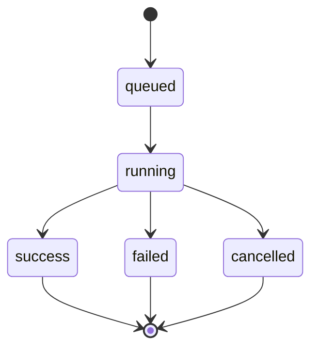
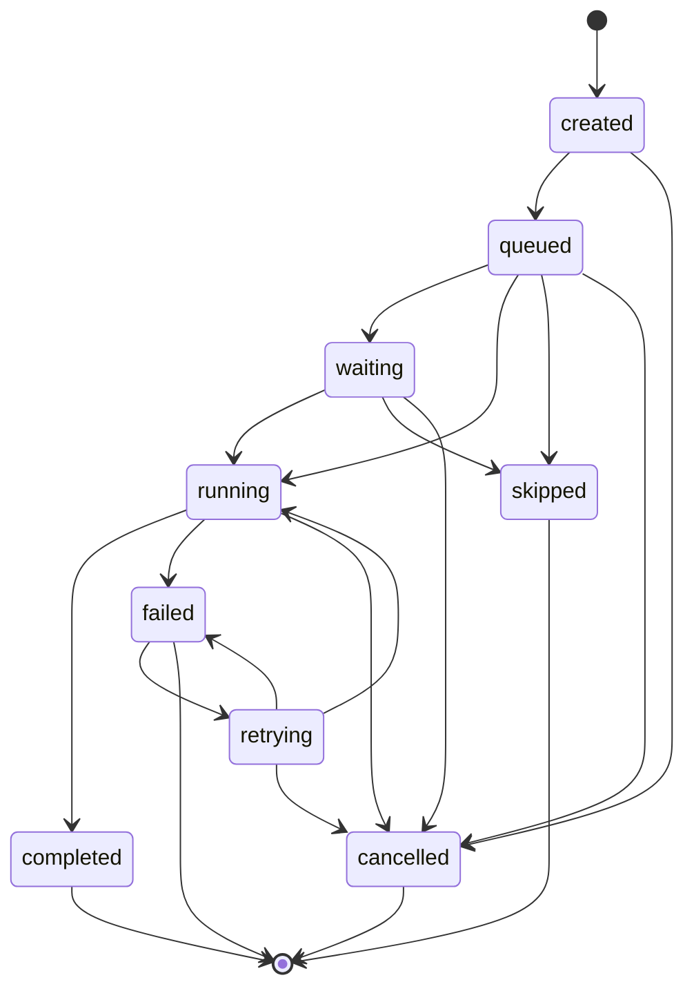

# Execution Lifecycle and State Machine Contract

## Execution Lifecycle

An execution moves through these states:

## Execution Status Rules

### queued

Entry:

- Execution row is created.
- Workflow exists and is executable.
- Runtime node rows may be created.

Allowed next:

- `running`
- `cancelled`

### running

Entry:

- Execution begins traversal.
- `started_at` is set.
- Root nodes are evaluated for readiness.

Allowed next:

- `success`
- `failed`
- `cancelled`

### success

Entry:

- All required executable nodes are `completed` or validly `skipped`.
- No uncaught execution error remains.

Terminal:

- Yes.

### failed

Entry:

- A required node fails with no retry remaining.
- Or the orchestration engine encounters an unrecoverable lifecycle error.

Terminal:

- Yes.

### cancelled

Entry:

- Cancellation is requested before terminal completion.
- Running plugins are signaled through `cancel_event`.
- Pending nodes are marked cancelled or skipped according to engine rules.

Terminal:

- Yes.

## Node Lifecycle

## Node Status Rules

### created

- Runtime record exists but has not been scheduled.
- Allowed next: `queued`, `cancelled`.

### queued

- Node is known by the scheduler.
- Allowed next: `waiting`, `running`, `skipped`, `cancelled`.

### waiting

- Node is blocked by dependencies or conditions.
- Allowed next: `running`, `skipped`, `cancelled`.

### running

- Plugin has received an `ExecutionEnvelope`.
- Allowed next: `completed`, `failed`, `cancelled`.

### completed

- Plugin returned `PluginResult.success = true`.
- Terminal.

### failed

- Plugin returned `PluginResult.success = false`, validation failed, timeout expired, or node execution raised a normal node-level failure.
- Allowed next: `retrying` only when attempts remain.
- Terminal when no retry remains.

### retrying

- Retry policy accepted another attempt.
- Allowed next: `running`, `failed`, `cancelled`.

### skipped

- Node was skipped due to dependency failure, condition result, or traversal policy.
- Terminal.

### cancelled

- Cancellation was requested before completion.
- Terminal.

## Retry Contract

Retry policy fields:

- `max_attempts`: total attempts including the first run.
- `backoff_base`: exponential backoff base.
- `max_delay`: maximum retry delay.
- `jitter`: whether randomized jitter is allowed.

Rules:

- Retry decisions belong to the workflow engine.
- Plugins do not schedule retries.
- A retry must emit `NodeRetrying`.
- Attempt count increments before each plugin `execute` call.

## Cancellation Contract

Rules:

- Cancellation is best effort for already running plugin work.
- Plugins must check or honor `ExecutionEnvelope.cancel_event`.
- Engine owns final persisted state.
- A cancelled execution must not later become success or failed.

## Skip Contract

Rules:

- Skipping is deterministic.
- Skipped nodes are considered successful for dependency closure only when skip policy permits it.
- A skipped required node must include a reason in timeline or event payload.

