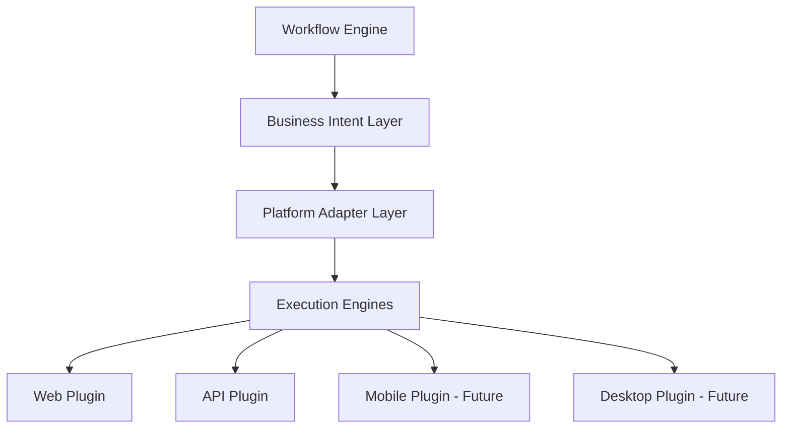
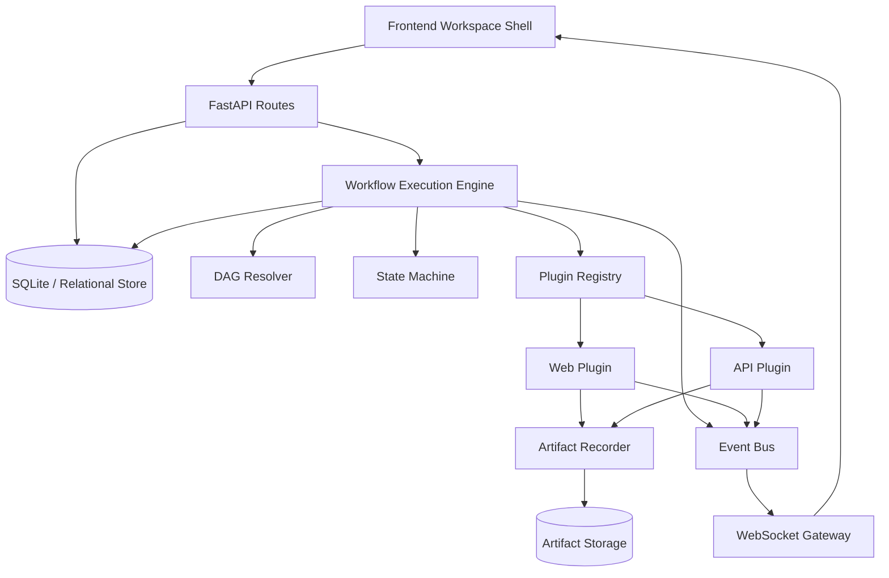
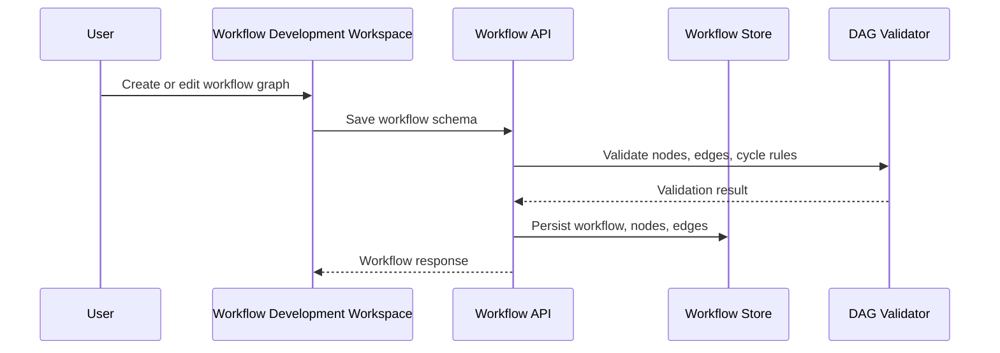
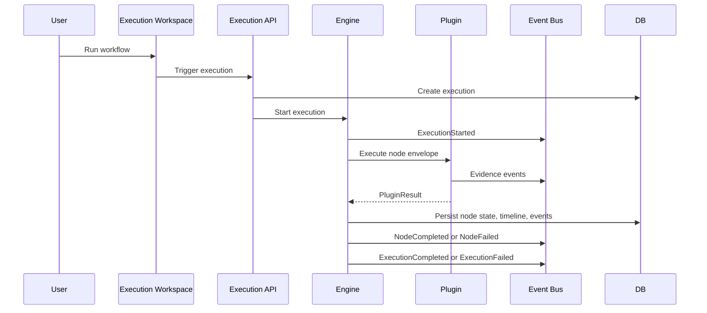
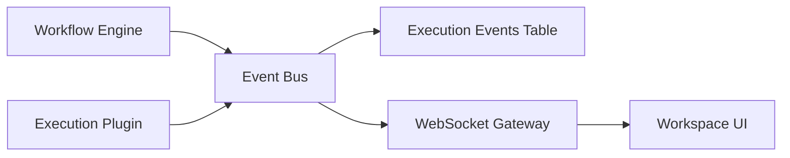

# System Maps

## Layered Architecture

```mermaid
flowchart TD
    A[Workflow Engine]
    B[Business Intent Layer]
    C[Platform Adapter Layer]
    D[Execution Engines]
    D1[Web Plugin]
    D2[API Plugin]
    D3[Mobile Plugin - Future]
    D4[Desktop Plugin - Future]

    A --> B
    B --> C
    C --> D
    D --> D1
    D --> D2
    D --> D3
    D --> D4
```

## Current Runtime Architecture

```mermaid
flowchart TD
    UI[Frontend Workspace Shell]
    API[FastAPI Routes]
    DB[(SQLite / Relational Store)]
    ENGINE[Workflow Execution Engine]
    DAG[DAG Resolver]
    SM[State Machine]
    REG[Plugin Registry]
    WEB[Web Plugin]
    HTTP[API Plugin]
    BUS[Event Bus]
    WS[WebSocket Gateway]
    ART[Artifact Recorder]
    FS[(Artifact Storage)]

    UI --> API
    API --> DB
    API --> ENGINE
    ENGINE --> DAG
    ENGINE --> SM
    ENGINE --> REG
    REG --> WEB
    REG --> HTTP
    WEB --> ART
    HTTP --> ART
    ART --> FS
    ENGINE --> BUS
    WEB --> BUS
    HTTP --> BUS
    BUS --> WS
    WS --> UI
    ENGINE --> DB
```

## Workflow Authoring Map

```mermaid
sequenceDiagram
    participant User
    participant UI as Workflow Development Workspace
    participant API as Workflow API
    participant DB as Workflow Store
    participant DAG as DAG Validator

    User->>UI: Create or edit workflow graph
    UI->>API: Save workflow schema
    API->>DAG: Validate nodes, edges, cycle rules
    DAG-->>API: Validation result
    API->>DB: Persist workflow, nodes, edges
    API-->>UI: Workflow response
```

## Execution Runtime Map

```mermaid
sequenceDiagram
    participant User
    participant UI as Execution Workspace
    participant API as Execution API
    participant Engine
    participant Plugin
    participant Bus as Event Bus
    participant DB

    User->>UI: Run workflow
    UI->>API: Trigger execution
    API->>DB: Create execution
    API->>Engine: Start execution
    Engine->>Bus: ExecutionStarted
    Engine->>Plugin: Execute node envelope
    Plugin->>Bus: Evidence events
    Plugin-->>Engine: PluginResult
    Engine->>DB: Persist node state, timeline, events
    Engine->>Bus: NodeCompleted or NodeFailed
    Engine->>Bus: ExecutionCompleted or ExecutionFailed
```

## Event Flow

```mermaid
flowchart LR
    Engine[Workflow Engine]
    Plugin[Execution Plugin]
    Bus[Event Bus]
    Persist[Execution Events Table]
    WS[WebSocket Gateway]
    UI[Workspace UI]

    Engine --> Bus
    Plugin --> Bus
    Bus --> Persist
    Bus --> WS
    WS --> UI
```

